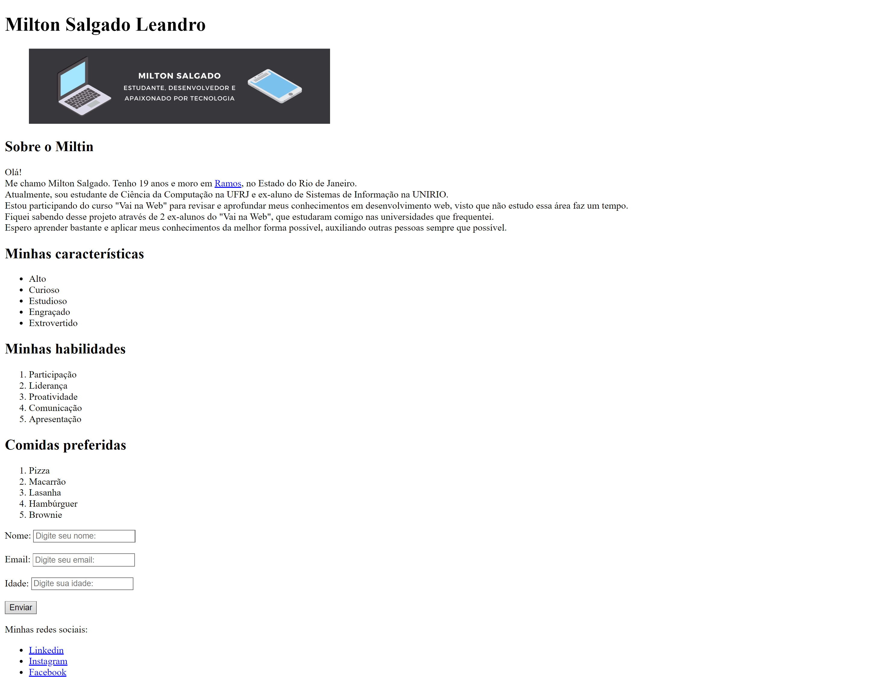

# 👋 About Me

Uma página web sobre mim.

## 📚 Tabela de Conteúdos

- [👋 About Me](#-about-me)
  - [📚 Tabela de Conteúdos](#-tabela-de-conteúdos)
  - [📋 Descrição](#-descrição)
    - [🚀 Funcionalidades](#-funcionalidades)
    - [🌐 Acesso](#-acesso)
    - [📸 Prévia](#-prévia)
  - [⚙️ Construção](#️-construção)
    - [💻 Tecnologias](#-tecnologias)
    - [🛠️ Ferramentas](#️-ferramentas)
    - [📌 Versão](#-versão)
  - [✏️ Aprendizado](#️-aprendizado)
  - [✒️ Autores](#️-autores)
  - [🎁 Agradecimentos](#-agradecimentos)
  - [📨 Contato](#-contato)

## 📋 Descrição

Este é um projeto de uma página web simples, contendo algumas informações e curiosidades sobre mim.
Esse projeto foi o desafio 01 do módulo 01 do curso de front-end do "Vai na Web", e tinha como proposta introduzir os principais conceitos de HTML (com pequenos ajustes com CSS) para construção e identificação de elementos em páginas semânticas.

### 🚀 Funcionalidades

As funcionalidades disponíveis para os usuários estão listadas abaixo:

- Acessar os links de redes sociais
- Preencher caixas de texto
- Ver recarregamento de página ao clicar no botão
- Visualizar uma página web simples e de fácil entendimento

### 🌐 Acesso

🖇️ [Clique aqui para acessar o projeto](https://milton-salgado.github.io/about-me/)

### 📸 Prévia

  

## ⚙️ Construção

Resumo geral dos recursos utilizados na construção do projeto.

### 💻 Tecnologias

Tecnologias utilizadas na construção do projeto:

### 🛠️ Ferramentas

Ferramentas utilizadas na construção do projeto:

### 📌 Versão

Utilizei o Git para o controle de versão. 

Versão atual: 1.0 (primeira versão). 

## ✏️ Aprendizado

Ao fazer esse projeto, aprendi a:

- Estilizar elementos com CSS
- Entender o funcionamento das tags fundamentais do HTML
- Criar uma página semântica com HTML
- Identificar os principais componentes de uma página semântica

## ✒️ Autores

* **Milton Salgado Leandro** - *Todo o Projeto* - [GitHub](https://github.com/milton-salgado)

## 🎁 Agradecimentos

* Agradeço ao instrutor João Pedro Belo e aos facilitadores Merry Esperança e Naiara Souza pelo auxílio no meu processo de aprendizagem e apoio na construção do projeto.
* Agradeço também a você, visitante, por visualizar o meu projeto!

## 📨 Contato

